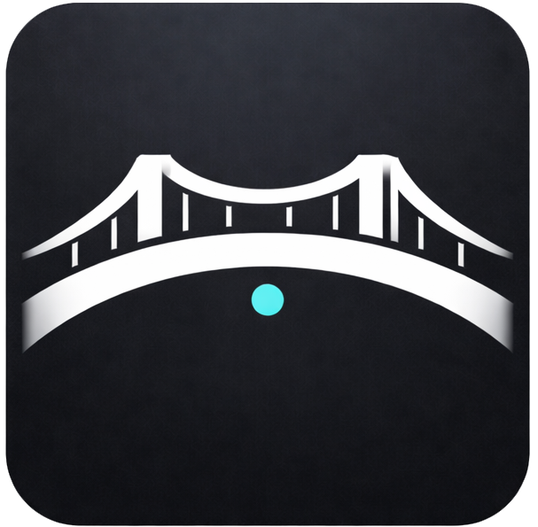

<div align="center">



# console-bridge

**Give your AI assistant access to browser console logs**

Let your agent see what you see — capture logs, debug errors, and inspect the DOM in real-time.

</div>

---

## Quick Start

### 1. Install Extension

1. Download `console-bridge-ext-v*.zip.zip` from the [latest release](https://github.com/vltansky/console-bridge-mcp/releases/latest)
2. Unzip to a permanent location (e.g., `~/.console-bridge-extension`)
3. Open Chrome → `chrome://extensions`
4. Enable "Developer mode" (toggle in top right)
5. Click "Load unpacked" → select the unzipped folder
6. Click the extension icon in toolbar → verify it shows "Connected"

### 2. Add MCP Server

**Cursor** (one-click): [Install](https://cursor.com/en/install-mcp?name=console-bridge&config=eyJjb21tYW5kIjoibnB4IiwiYXJncyI6WyIteSIsImNvbnNvbGUtYnJpZGdlLW1jcEBsYXRlc3QiXX0=)

**Manual** — add to your MCP config:

```json
{
  "mcpServers": {
    "console-bridge": {
      "command": "npx",
      "args": ["-y", "console-bridge-mcp@latest"]
    }
  }
}
```

### 3. Use It

```
Show me all error logs from localhost:3000
```

```
Execute: document.querySelector('.submit-btn').click()
```

```
Query DOM for '.error-message' and get textContent
```

---

## What You Can Do

| Prompt | What Happens |
|--------|--------------|
| `Show error logs from the last 5 minutes` | Filters logs by level and time range |
| `Show logs from localhost:3000` | Filters logs by URL pattern |
| `Search for "authentication failed"` | Regex/keyword search across all logs |
| `Tail logs from the current tab` | Streams new logs as they appear |
| `Show me a snapshot of recent errors` | Summarizes error counts and patterns |
| `Execute: localStorage.getItem('token')` | Runs JS in the page, returns result |

---

## MCP Tools

| Tool | Purpose |
|------|---------|
| `console_tabs` | List/suggest browser tabs |
| `console_logs` | List, get, or tail logs |
| `console_search` | Regex/keyword search |
| `console_snapshot` | Quick error summary |
| `console_browser_execute` | Run JS or query DOM |
| `console_browser_info` | Get page title/URL |
| `console_sessions` | Save/load log snapshots |
| `console_skills_list/load` | Project-specific playbooks |

---

## Configuration

```bash
CONSOLE_MCP_PORT=9847              # WebSocket port
CONSOLE_MCP_MAX_LOGS=10000         # Max logs in memory
CONSOLE_MCP_LOG_TTL_MINUTES=60     # Auto-cleanup (0 = unlimited)
```

---

## Architecture

```
Browser Extension  ──WebSocket──▶  MCP Server  ◀──stdio──  AI Assistant
(captures logs)                    (stores/queries)        (Cursor/Claude)
```

---

## Development

```bash
npm install && npm run build
npm run dev:server    # Hot reload server
npm run dev:extension # Hot reload extension
```

---

## License

MIT
